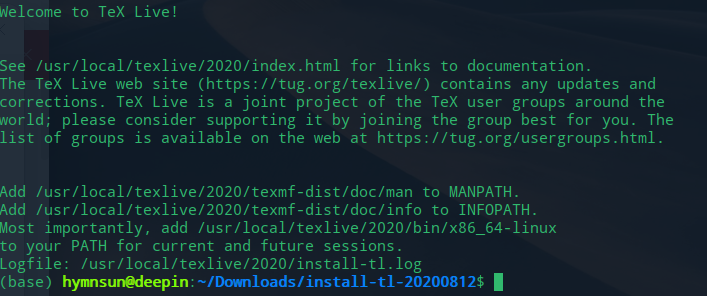

# config log

## texlive2020
- `sudo apt-install texlive-full`
- 环境变量：[MANPATH、INFOPATH、PATH](https://www.cnblogs.com/lixuebin/p/10814863.html)

    - run `dedit ./bashrc`
    - copy the cotent bellow,save and exit
        ```
        # TeX Live 2020
        PATH=/usr/local/texlive/2020/bin/x86_64-linux:$PATH; export PATH
        MANPATH=/usr/local/texlive/2020/texmf-dist/doc/man:$MANPATH; export MANPATH
        INFOPATH=/usr/local/texlive/2020/texmf-dist/doc/info:$INFOPATH; export INFOPATH
        ```
    - run `source ~/.bashrc` to make it work
    - test in terminal via `tex -v`
 
- install:`sudo apt-get install texstudio`
- 中文字体复制安装到linux【未做】
- [texlive 缺少xelatex包](https://blog.csdn.net/qq_34369618/article/details/77568520)
    ```
    sudo apt-get install texlive-xetex 
    sudo apt-get install texlive-lang-chinese  #{xeCJK}
    ```
- xelatex路径未识别【两台电脑均已解决】

- 问题：[部分包不全，无法更新宏包](https://www.cnblogs.com/lzhu/p/10457162.html)