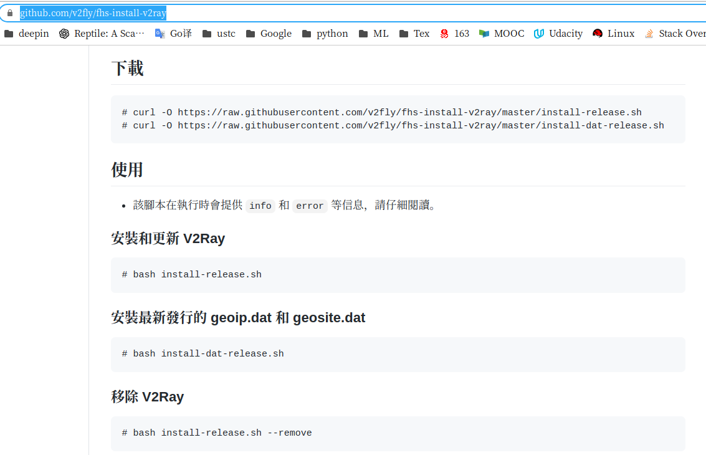

# deepin v20体验 {ignore}
[TOC]

## 设置
- 终端ctrl+C不要修改
- 系统字体为Noto Serif CJK JP

------
## 软件
### 基础软件
- 自带编辑器dedit
- 讯飞输入法，英文键盘和讯飞 切换输入法ctrl+space
- 微信 TIM
- wps
- 迅雷
- 向日葵是
- 网易云音乐
- ~~aria2!~~
    - install aria2:`sudo apt-get install aria2`
    - download aria2 file contain `.conf`,`.log`,`.session` file
    - modify `.conf` file which links to download dir & RPC secret token
    - run aria2 via `aria2c --conf-path='/home/hymnsun/aria2/aria2.conf'`
    - download [AriaNg(front-end)](https://github.com/mayswind/AriaNg/releases) from Github.
    - click `index.html` to fill in RPC secret token in AriaNg settings.
    - download BaidunYun 

`
### 工作软件
#### anaconda
- `conda info`
    安装路径： /home/hymnsun/anaconda3
- `conda env list`
    ```    
    conda create -n tf10 python=3.7 numpy pandas tensorflow=1.15
    conda remove -n <env_name> --all
    conda activate tf10
    conda deactivate
    ```
- conda 更换国内源

    - 修改 ~/.condarc文件，复制USTC源路径
        ```
        channels:
            - https://mirrors.ustc.edu.cn/anaconda/pkgs/main/
            - https://mirrors.ustc.edu.cn/anaconda/pkgs/free/
            - https://mirrors.ustc.edu.cn/anaconda/cloud/conda-forge/
            - defaults
        ssl_verify: true
        ```
    - terminel
        ```
        conda config --add channels https://mirrors.tuna.tsinghua.edu.cn/anaconda/pkgs/free/
        conda config --add channels https://mirrors.tuna.tsinghua.edu.cn/anaconda/pkgs/main/
        conda config --set show_channel_urls yes
        ```

    - 恢复默认源：
        `conda config --remove-key channels`

- 修改jupyter notebook工作路径：
    ```
    jupyter notebook --generate-config
    cd ~
    mkdir jupytercode
    vi /home/hymnsun/.jupyter/jupyter_notebook_config.py
    ```
- 修改jupyter notebook工作路径：
    `cd ~`
    `mkdir jupytercode`
    `vi /home/hymnsun/.jupyter/jupyter_notebook_config.py`
        c.NotebookApp.notebook_dir =''

#### pycharm
- python脚本设置
    ```
    #!/usr/bin/python
    # -*- coding: utf-8 -*-
    ```

- [jupyter notebook 添加其它环境kernel](https://blog.csdn.net/wyz6666/article/details/83314761)
    ```
    conda activate tf10
    which python       // 当前环境python路径
    sudo <python dir> -m ipykernel install --name <kernel_name>
    ```

- 基础设置
    - tips of the day
    - 设置ctrl+鼠标放大
    - Show line numbers          // right click 
    - 设置python intepreter

#### v2Ray
- ~~download `v2ray-linux-64.zip` in [Github](https://github.com/v2ray/v2ray-core/releases/)~~
- ~~download `go.sh` via `wget https://install.direct/go.sh`~~
- ~~在上述两个文件同一目录下，run `sudo bash go.sh --local ./v2ray-linux-64.zip`~~
- 根据提示https://install.direct/go.sh已弃用


    这种方法配置文件分成了多个`/usr/local/etc/v2ray` 不会处理
    
- [**使用原来的go.sh文件**](https://www.280i.com/case/7935.html)
    下载失败注意修改*DOWNLOAD_LINK=*
    - run `sudo bash go.sh` in dir contains go.sh
    - edit `config.json` in `/etc/v2ray/config.json` file which can copy from windows
    
    - 设置自启动，查看状态
        ```
        启动 `systemctl start v2ray`
        停止 `systemctl stop v2ray`
        重启 `systemctl restart v2ray`
        开机自启 `systemctl enable v2ray`
        查看状态 `service v2ray status`
        ```
    - 配置代理时报错？？？？

#### texlive
- install:`sudo apt-get install texstudio`
- 中文字体复制安装到linux
- texlive 缺少ctex 包
- xelatex路径未识别

#### chrome
#### vscode
- ctrl+shift+K 删除当前行
- alt+鼠标左键 选中多行
- 插件：MPE
    


--------

## LINUX 指令
    sudo apt-get install [software]
    sudo apt-get remove [software]
    sudo apt-get upgrade 更新已安装包
        
    pwd 显示当前路径
    ls -a 显示所有文件
    ls -la 且显示权限等详细信息
    chmod u+x filename        修改可执行权限
    mkdir <dir_name> 创建目录
    which python


### VIM基本指令
    三种模式：
    查找：
        

### docker的配置

-------------
## Git管理
- git 连接github：
    ```
    ssh-keygen -t rsa -C "XXXXXXXXX@163.com"
    key dir：/home/hymnsun/.ssh/id_rsa
    ```
### [blog](https://blog.csdn.net/Arisstz/article/details/80708851)
- 安装nodejs和npm
    ```
    sudo apt-get install nodejs npm
    ```
- 配置环境变量
- 


### python_basic

-------
## BUG
- [x] 无法安装texstudio for linux 导致系统锁死
    >  sudo apt --fix-broken install

- 08/17 in MSI 卡死，键盘没反应，鼠标延迟高卡死，怀疑在后台更新系统

------
## what to do
- 梯子
- texstudio无法安装
