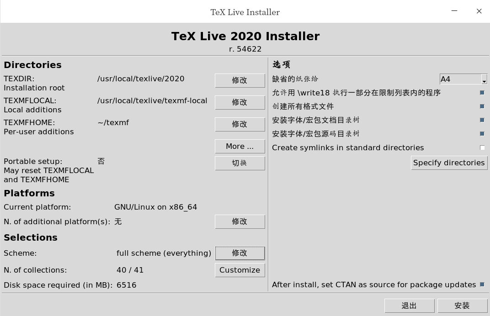
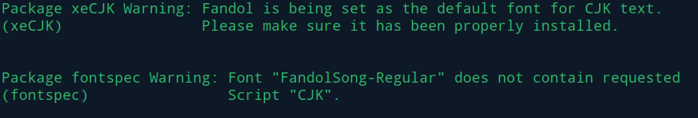
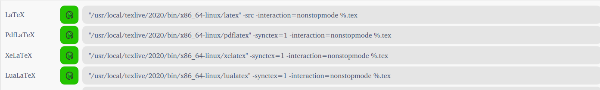

## 工作软件
### 1 anaconda
- `conda info`
    安装路径： /home/hymnsun/anaconda3
- `conda env list`
    ```    
    conda create -n tf10 python=3.7 numpy pandas tensorflow=1.15
    conda remove -n <env_name> --all
    conda activate tf10
    conda deactivate
    ```
- conda 更换国内源

    - 修改 ~/.condarc文件，复制USTC源路径
        ```
        channels:
            - https://mirrors.ustc.edu.cn/anaconda/pkgs/main/
            - https://mirrors.ustc.edu.cn/anaconda/pkgs/free/
            - https://mirrors.ustc.edu.cn/anaconda/cloud/conda-forge/
            - defaults
        ssl_verify: true
        ```
    - terminel
        ```
        conda config --add channels https://mirrors.tuna.tsinghua.edu.cn/anaconda/pkgs/free/
        conda config --add channels https://mirrors.tuna.tsinghua.edu.cn/anaconda/pkgs/main/
        conda config --set show_channel_urls yes
        ```

    - 恢复默认源：
        `conda config --remove-key channels`

- 修改jupyter notebook工作路径：
    ```
    jupyter notebook --generate-config
    cd ~
    mkdir jupytercode
    vi /home/hymnsun/.jupyter/jupyter_notebook_config.py
    ```
- 修改jupyter notebook工作路径：
    `cd ~`
    `mkdir jupytercode`
    `vi /home/hymnsun/.jupyter/jupyter_notebook_config.py`
        c.NotebookApp.notebook_dir =''

### 2 Pycharm
- python脚本设置
    ```
    #!/usr/bin/python
    # -*- coding: utf-8 -*-
    ```

- [jupyter notebook 添加其它环境kernel](https://blog.csdn.net/wyz6666/article/details/83314761)
    ```
    conda activate tf10
    which python       // 当前环境python路径
    sudo <python dir> -m ipykernel install --name <kernel_name>
    ```

- 基础设置
    - tips of the day
    - 设置ctrl+鼠标放大
    - Show line numbers          // right click 
    - 设置python intepreter

### 3 V2Ray
- [log](./config_log.md)
- [脚本安装 新教程github](https://github.com/v2fly/fhs-install-v2ray)
- run `bash <(curl -L https://raw.githubusercontent.com/v2fly/fhs-install-v2ray/master/install-release.sh)`

- 配置config.json,文件在`deepin_config/V2ray/config_deault.json`,替换服务器ip和端口，修改完成后重命名为`config.json`
    ```
    {
    "inbounds": [{
        "port": listen port, // number 
        "listen": "127.0.0.1",
        "protocol": "socks",
        "settings": {
        "udp": true
        }
    }],
    "outbounds": [{
        "protocol": "vmess",
        "settings": {
        "vnext": [{
            "address": "your server ip", 
            "port": server port,
            "users": [
                { 
                    "id": "server id " ,
                    "alterId": server alterid
                }
            ]
        }]
        }
    },{
        "protocol": "freedom",
        "tag": "direct",
        "settings": {}
    }],
    "routing": {
        "domainStrategy": "IPOnDemand",
        "rules": [{
        "type": "field",
        "ip": ["geoip:private"],
        "outboundTag": "direct"
        }]
    }
    }
    ```
- 将上述配置完成的`config.json`文件替换脚本安装默认生成的`config.json`
    - 进入配置完成的'config.json'目录下打开终端
    - run `cp config.json /usr/local/etc/v2ray/config.json` 后会替换默认的配置文件

- 启动v2ray并设置开机重启，执行以下两条命令即可  
    - 开机自启 `systemctl enable v2ray`
    - 启动 `systemctl start v2ray`
    - 其他命令
        - 停止 `systemctl stop v2ray`
        - 重启 `systemctl restart v2ray`  
        - 查看状态 `service v2ray status`

- vray默认不代理流量，所以需要配置代理
    - 系统手动配置代理:127.0.0.1:listen port
    - 谷歌浏览器安装`SwitchyOmega`插件，配置代理以及自动代理PAC,关闭系统全局代理
    - 火狐浏览器同样可以安装插件，或者直接配置sock5代理
        - 下载火狐浏览器`sudo apt install firefox` 提示软件源没有，linux增加源之后再学
        - 浏览器下载火狐浏览器
            - `tar -vxjf firefox.tar.bz2`
            - 将火狐浏览器二进制文件夹移动到`/usr/local/`目录下：`mv firefox/ /usr/local/firefox/`
            - 创建火狐软链接 `/usr/bin`目录下：`sudo ln -s /usr/local/firefox/firefox /usr/bin/firefox`
            - `cd /usr/bin`
            - `ls -la firefox`


### 4 Texlive2020
- [error log](./config_log.md)
- [linux完全卸载texlive](https://blog.csdn.net/qq_40199232/article/details/106505730)
    ```
    sudo apt-get purge texlive*
    rm -rf /usr/local/texlive/2020
    rm -rf ~/.texlive2020
    rm -rf /usr/local/share/texmf
    rm -rf /var/lib/texmf
    rm -rf /etc/texmf
    sudo apt-get remove tex-common --purge
    rm -rf ~/.texlive
    ```
- [下载texlive2020镜像](http://iso.mirrors.ustc.edu.cn/CTAN/systems/texlive/Images/texlive2020-20200406.iso)

- [install]((https://www.cnblogs.com/lzhu/p/10457162.html))
    ```
    sudo mount -o loop [texlive2020.iso] /mnt/
    cd /mnt/
    sudo ./install-tl --gui
    ```
    

- 卸载镜像`sudo umount /mnt`
- 添加环境变量
    - run `dedit ./bashrc`
    - copy the cotent bellow,save and exit
        ```
        # TeX Live 2020
        PATH=/usr/local/texlive/2020/bin/x86_64-linux:$PATH; export PATH
        MANPATH=/usr/local/texlive/2020/texmf-dist/doc/man:$MANPATH; export MANPATH
        INFOPATH=/usr/local/texlive/2020/texmf-dist/doc/info:$INFOPATH; export INFOPATH
        ```
    - run `source ~/.bashrc` to make it work
    - test in terminal via `tex -v`
- 测试{xeCJK}和包更新
    - `sudo apt-get install texlive-xetex`               # 测试是否需要
    - `sudo apt-get install texlive-lang-chinese`        #{xeCJK}
    
    - **修改xelatex路径解决包识别** [可选]
    
    - 模板
        ```
        \documentclass{article}
        \usepackage{xeCJK}

        \begin{document}
            hello, \LaTeX{}  
            
            中国
        \end{document}
        ```

### 5 VScode
- ctrl+shift+K 删除当前行
- alt+鼠标左键 选中多行
- 插件：MPE
- 中文模式下不能拖选

