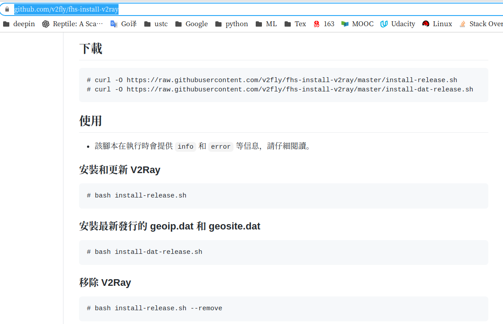
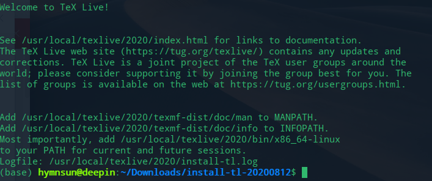
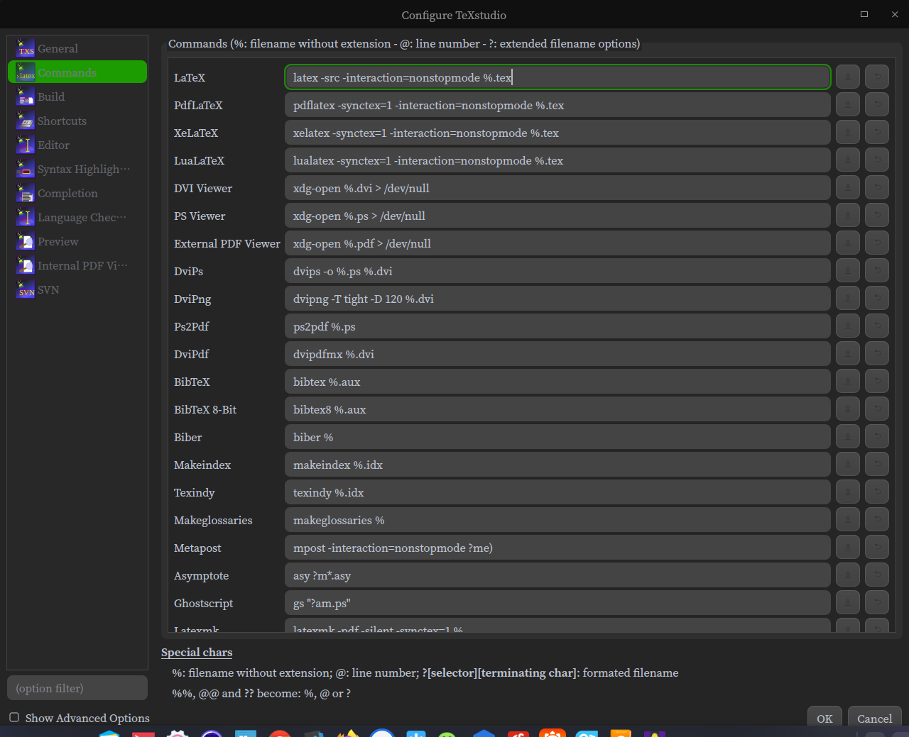

[TOC]

#### anaconda
- `conda info`
    安装路径： /home/hymnsun/anaconda3
- `conda env list`
    ```    
    conda create -n tf10 python=3.7 numpy pandas tensorflow=1.15
    conda remove -n <env_name> --all
    conda activate tf10
    conda deactivate
    ```
- conda 更换国内源

    - 修改 ~/.condarc文件，复制USTC源路径
        ```
        channels:
            - https://mirrors.ustc.edu.cn/anaconda/pkgs/main/
            - https://mirrors.ustc.edu.cn/anaconda/pkgs/free/
            - https://mirrors.ustc.edu.cn/anaconda/cloud/conda-forge/
            - defaults
        ssl_verify: true
        ```
    - terminel
        ```
        conda config --add channels https://mirrors.tuna.tsinghua.edu.cn/anaconda/pkgs/free/
        conda config --add channels https://mirrors.tuna.tsinghua.edu.cn/anaconda/pkgs/main/
        conda config --set show_channel_urls yes
        ```

    - 恢复默认源：
        `conda config --remove-key channels`

- 修改jupyter notebook工作路径：
    ```
    jupyter notebook --generate-config
    cd ~
    mkdir jupytercode
    vi /home/hymnsun/.jupyter/jupyter_notebook_config.py
    ```
- 修改jupyter notebook工作路径：
    `cd ~`
    `mkdir jupytercode`
    `vi /home/hymnsun/.jupyter/jupyter_notebook_config.py`
        c.NotebookApp.notebook_dir =''

#### pycharm
- python脚本设置
    ```
    #!/usr/bin/python
    # -*- coding: utf-8 -*-
    ```

- [jupyter notebook 添加其它环境kernel](https://blog.csdn.net/wyz6666/article/details/83314761)
    ```
    conda activate tf10
    which python       // 当前环境python路径
    sudo <python dir> -m ipykernel install --name <kernel_name>
    ```

- 基础设置
    - tips of the day
    - 设置ctrl+鼠标放大
    - Show line numbers          // right click 
    - 设置python intepreter

#### v2Ray
- ~~download `v2ray-linux-64.zip` in [Github](https://github.com/v2ray/v2ray-core/releases/)~~
- ~~download `go.sh` via `wget https://install.direct/go.sh`~~
- ~~在上述两个文件同一目录下，run `sudo bash go.sh --local ./v2ray-linux-64.zip`~~
- 根据提示https://install.direct/go.sh已弃用


    这种方法配置文件分成了多个`/usr/local/etc/v2ray` 不会处理
    
- [**使用原来的go.sh文件**](https://www.280i.com/case/7935.html)
    下载失败注意修改*DOWNLOAD_LINK=*
    - run `sudo bash go.sh` in dir contains go.sh
    - edit `config.json` in `/etc/v2ray/config.json` file which can copy from windows
    
    - 设置自启动，查看状态
        ```
        启动 `systemctl start v2ray`
        停止 `systemctl stop v2ray`
        重启 `systemctl restart v2ray`
        开机自启 `systemctl enable v2ray`
        查看状态 `service v2ray status`
        ```
    - 配置代理时报错？？？？

#### texlive
- 环境变量：[MANPATH、INFOPATH、PATH](https://www.cnblogs.com/lixuebin/p/10814863.html)

    - run `dedit ./bashrc`
    - copy the cotent bellow,save and exit
        ```
        # TeX Live 2020
        PATH=/usr/local/texlive/2020/bin/x86_64-linux:$PATH; export PATH
        MANPATH=/usr/local/texlive/2020/texmf-dist/doc/man:$MANPATH; export MANPATH
        INFOPATH=/usr/local/texlive/2020/texmf-dist/doc/info:$INFOPATH; export INFOPATH
        ```
    - run `source ~/.bashrc` to make it work
    - test in terminal via `tex -v`
 
- install:`sudo apt-get install texstudio`
- 中文字体复制安装到linux
- [texlive 缺少xelatex包](https://blog.csdn.net/qq_34369618/article/details/77568520)
    ```
    sudo apt-get install texlive-xetex 
    sudo apt-get install texlive-lang-chinese  #{xeCJK}
    ```
- xelatex路径未识别【笔记本上未发现】


#### chrome
#### vscode
- ctrl+shift+K 删除当前行
- alt+鼠标左键 选中多行
- 插件：MPE